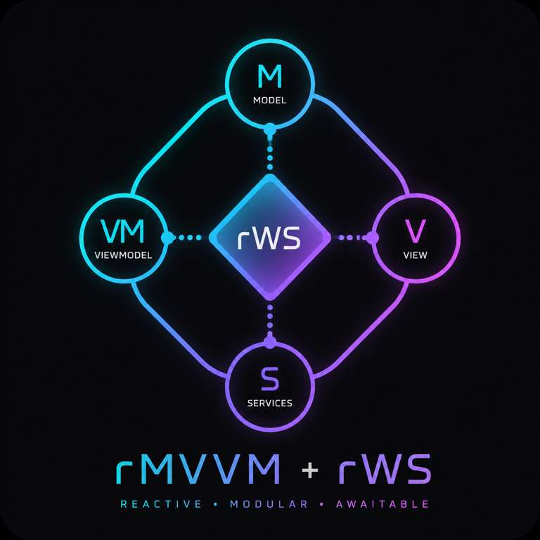

# rMVVM

> A lightweight **Reactive MVVM** architecture for Unity, paired with **rWS (Reactive Window System)** for awaitable, DI-driven UI navigation.

## Features

- ⚡ Reactive UI with R3
- 🧩 VContainer dependency injection
- 🪟 Awaitable window routing (rWS)
- 🧠 Clean MVVM architecture
- 🧪 Testable, framework-agnostic ViewModels
- 🚀 Minimal boilerplate

Documentation:

- 📖 [rMVVM.md](Documentation/rMVVM.md)
- 📖 [ReactiveWindowSystem.md](Documentation/ReactiveWindowSystem.md)